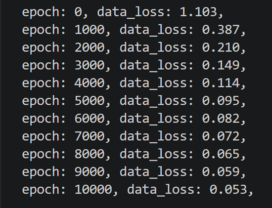
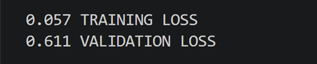

# NeuralTorchwork
An artificial neural network developed with the PyTorch framework.

---

## Table of Contents
- [About the project](#goals)
- [Status Quo](#statusquo)
- [Whats's next?](#todo)

## About the project
NeuralTorchwork is one of three simple neural networks created for classification exercises. Each is coded using a different set of frameworks:

- [NeuralScratchwork](https://github.com/Yaaramir/NeuralScratchwork): This network is created with raw Python and only implements NumPy to organize and utilize data in arrays. This repository dictates the speed and content of the other two, as it serves as the template for both.
- [NeuralTorchwork](https://github.com/Yaaramir/NeuralTorchwork): Based on NeuralScratchwork this project makes use of the [PyTorch framework](https://pytorch.org/) developed by Meta's AI Research lab.
- [NeuralFlowwork](https://github.com/Yaaramir/NeuralFlowwork): Based on NeuralScratchwork this project makes use of the [TensorFlow framework](https://www.tensorflow.org/) developed by Alphabet Inc.'s Google Brain Team.

The first goal is to implement a complete network from scratch in ***NeuralScratchwork*** that can be trained and used for simple classification exercises while implementing the PyTorch and TensorFlow solutions simultaneously.

Once that stage is completed, ***NeuralTorchwork*** will be further developed to be deployed for scientific usage within the [OpenFlexure](https://openflexure.org/) project, while ***NeuralFlowwork*** will transformed in an office and smart home scenario.

Since understanding how neural networks work at its core and learning how to use them successfully is and has been the main goal of this project, development does not necessarily follow the fastes or most efficient way, but often takes a detour to fully capture the edges, boundaries, challenges and oportunities the frameworks and underlying paradigms offer.

Idea and architecture of the NeuralScratchwork are conceived and heavily inspired by [Neural Networks from Scratch](https://nnfs.io/) (Kinsley H., Kukiela D., 2020).

## Status Quo
- A simple model with two linear dense layers, ReLU, and Softmax activation functions has been implemented. CCE has been chosen for loss calculation and Adam as the optimizer.
- A 2D dataset with three classes of dots spiraling around a center point is implemented.

- The network trains for 10k epochs by performing forward passes, backward passes, gradient calculation, and parameter updating.

- A test dataset is used to evaluate model performance after training.

## What's next?
Since this network currently follows the progression of NeuralScratchwork, development will aim for a PyTorch-native implementation of its Status Quo. 
- Validation is required for both validation of the model's correct data procession and hyperparameter tuning.
- Regularization will be implemented next to avoid overfitting.
- Different model architectures and layer sizes will be experimented with to identify the best-fitting model and detect potential imbalances in the calculations.