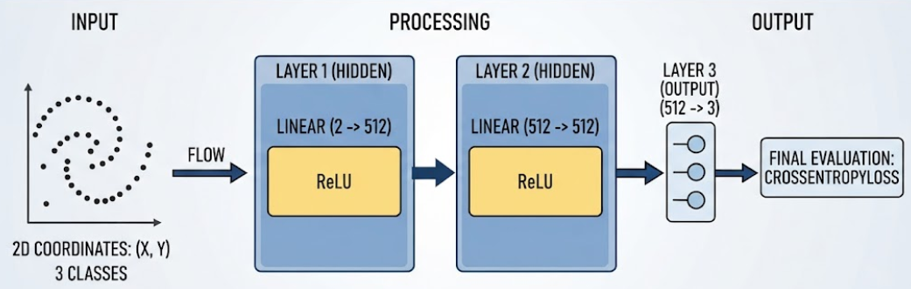
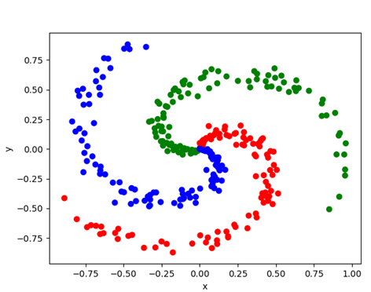
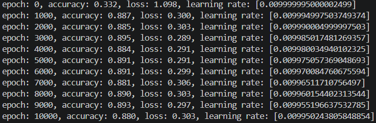
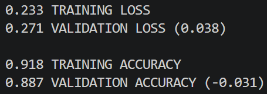

# NeuralTorchwork
An artificial neural network developed with the PyTorch framework.

## Table of Contents
- [About the project](#about-the-project)
- [Status Quo](#status-quo)
- [Whats's next?](#whats-next)

## About the project
NeuralTorchwork is one of three simple neural networks created for classification exercises. Each is coded using a different set of frameworks:

- [NeuralScratchwork](https://github.com/Yaaramir/NeuralScratchwork): This network is created with raw Python and only implements NumPy to organize and utilize data in arrays. This repository dictates the speed and content of the other two, as it serves as the template for both.
- [NeuralTorchwork](https://github.com/Yaaramir/NeuralTorchwork): Based on NeuralScratchwork this project makes use of the [PyTorch framework](https://pytorch.org/) developed by Meta's AI Research lab.
- [NeuralFlowwork](https://github.com/Yaaramir/NeuralFlowwork): Based on NeuralScratchwork this project makes use of the [TensorFlow framework](https://www.tensorflow.org/) developed by Alphabet Inc.'s Google Brain Team.

The first goal is to implement a complete network from scratch in ***NeuralScratchwork*** that can be trained and used for simple classification exercises while implementing the PyTorch and TensorFlow solutions simultaneously.

Once that stage is completed, ***NeuralTorchwork*** will be further developed to be deployed for scientific usage within the [OpenFlexure](https://openflexure.org/) project, while ***NeuralFlowwork*** will transformed in an office and smart home scenario.

Since understanding how neural networks work at its core and learning how to use them successfully is and has been the main goal of this project, development does not necessarily follow the fastes or most efficient way, but often takes a detour to fully capture the edges, boundaries, challenges and oportunities the frameworks and underlying paradigms offer.

Idea and architecture of the NeuralScratchwork are conceived and heavily inspired by [Neural Networks from Scratch](https://nnfs.io/) (Kinsley H., Kukiela D., 2020).

## Status Quo
- ### Model:
  - 2 hidden layers with ReLU
  - 1 output layer
  - CCE with implemented softmax

  

- ### Data:
A training dataset of spiraling points in a 2D space with 1,000 samples and 3 classes is created, using the nnfs.io dataset library.

- ### Training:
The network trains for 10k epochs by performing forward passes, backward passes, gradient calculation, and parameter updating.

- ### Validation:
A validation dataset is used to evaluate model performance after training.

- ### Evaluation:
  - Accuracy and loss both reach the values targeted at this stage of development. It is expected to see an increase once further updates have been implemented.
  - Training and validation show no indication of overfitting, since their values differ only slighty while a small difference is to be expected while validating.

## What's next?
Since this network currently follows the progression of NeuralScratchwork, development will aim for a PyTorch-native implementation of its Status Quo. 
- The Evaluation expresses the need for hyperparameter management and experimienting to avoid overfitting and training stagnation.
- More layers and dropout will be considered and tested.
- Different model architectures and layer sizes will be experimented with to identify the best-fitting model and detect potential imbalances in the calculations.

___

[_Jump back to the top_](#neuraltorchwork)